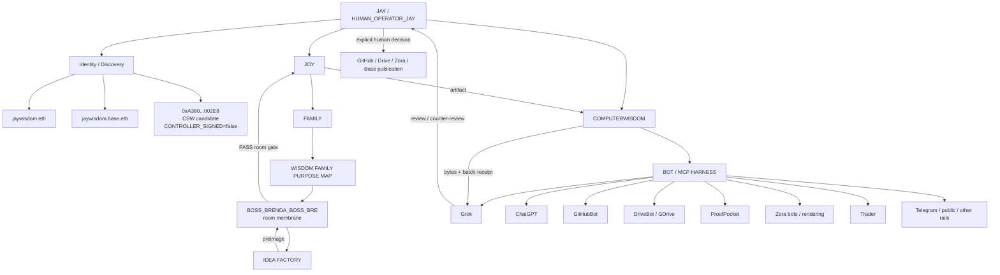

# Jay Bot Room Control Plane V0.1

**Status:** DESIGN_CANDIDATE  
**Date:** 2026-09-02  
**Operator:** JAY / JASON WISDOM  
**Human seat:** `HUMAN_OPERATOR_JAY_L2_V0_1`  
**Authority created:** false  
**No fake green:** true

## Purpose

Design the live bot room so identity, family continuity, bot execution, MCP access, wallet signing, merge, review, and publication remain separate.

The design has one human decision seat and three unmerged surfaces:

```text
JAY / JASON WISDOM
= HUMAN_OPERATOR_JAY_L2_V0_1
= merge / verify / human sign-spend decision

jaywisdom.eth / jaywisdom.base.eth
= identity / discovery / namespace
!= human operator

0xA380...002E8
= Coinbase Smart Wallet controller candidate
= technical signing surface after receipt proves control
CONTROLLER_SIGNED = false
```

## Frozen Tree



## Seat Law

### Human operator

`HUMAN_OPERATOR_JAY_L2_V0_1` is the only seat in this design allowed to make final merge, verification, signing, or spend decisions.

```text
JAY = operator
JAY != ENS string
JAY != wallet address
JAY != bot
```

### Boss Bre

`BOSS_BRENDA_BOSS_BRE` is the family room membrane.

```text
purpose = room_safety_joy_reset_privacy_guard
allowed = HOLD | SEND_BACK_TO_IDEA_FACTORY | PASS_ROOM_GATE
forbidden = MERGE | SIGN | SPEND | GROK_VERDICT | FAMILY_CONSENT
```

Boss Bre runs the room, not truth.

### COMPUTERWISDOM

COMPUTERWISDOM runs the bot and MCP harness.

```text
allowed = dispatch | hash | batch_receipt | byte_check | deny_closed | route_hold
forbidden = family_consent | wallet_spend | human_merge_decision
```

### Grok

Grok is an independent reviewer / counter-player.

```text
requires = batch_receipt_before_verdict
missing_proof = HELD
can_merge = false
can_sign = false
can_verify_self_as_final = false
```

### Tool / rail bots

GitHubBot, DriveBot/GDrive, ProofPocket, Zora bots, Trader, TelegramBot, rendering surfaces, and other rails remain bounded players or witnesses.

```text
CAN_INHERIT_JAY = false
CAN_MERGE = false
CAN_SIGN = false
CAN_SPEND = false
CAN_SELF_PROMOTE = false
```

## Factory Order

```text
IDEA FACTORY
-> preimage
-> BOSS BRE room gate
-> JOY artifact
-> COMPUTERWISDOM bytes / receipts
-> GROK review / counter-review
-> HUMAN_OPERATOR_JAY decision
-> GitHub / Drive / Zora / Base publication
```

No stage may silently skip the prior gate.

## MCP / Coinbase Boundary

```text
MCP_ACCESS != AUTHORITY
TOOL_OUTPUT != TRUTH
AGENT_ACTION != MERGE_AUTHORITY
ENS_NAMESPACE != COMPLETED_ANCHOR
WALLET_PRESENT != CONTROLLER_SIGNED
APP_QR != CONTROL_PROOF
```

Coinbase / Base tooling may read, prepare, and emit candidate receipts. It may not move funds from `0xA380...002E8` without an explicit human action from Jay.

## Cut 1 Hold

```text
0xA380_ACCOUNT_TYPE = COINBASE_SMART_WALLET_CONTRACT
NATIVE_VERIFY_PATH = EIP-1271
CONTROLLER_SIGNED = false
SEAL_STATE = OPEN
```

This design does not rewrite Cut 1.

## Room Constitution

> Boss Bre runs the room. COMPUTERWISDOM runs the bots. Jay decides merge/sign/spend. Wallets move only after Jay acts. Receipts promote. MCP is access, not authority.

## Promotion Law

```text
facts_promoted = 0
edges_inferred = 0
silent_inference = BLOCKED
authority_created = false
```

A future receipt may change a specific edge only when the exact edge and authorizing receipt are named.
