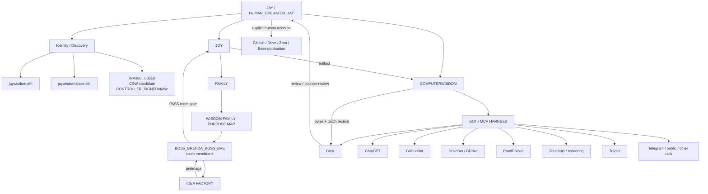

# Jay Bot Room Control Plane V0.1

**Status:** DESIGN_CANDIDATE  
**Date:** 2026-09-02  
**Operator:** JAY / JASON WISDOM  
**Human seat:** `HUMAN_OPERATOR_JAY_L2_V0_1`  
**Authority created:** false  
**No fake green:** true

## Purpose

Design the live bot room so identity, family continuity, bot execution, MCP access, wallet signing, merge, review, and publication remain separate.

The design has one human decision seat and three unmerged surfaces:

```text
JAY / JASON WISDOM
= HUMAN_OPERATOR_JAY_L2_V0_1
= merge / verify / human sign-spend decision

jaywisdom.eth / jaywisdom.base.eth
= identity / discovery / namespace
!= human operator

0xA380...002E8
= Coinbase Smart Wallet controller candidate
= technical signing surface after receipt proves control
CONTROLLER_SIGNED = false
```

## Frozen Tree



## Seat Law

### Human operator

`HUMAN_OPERATOR_JAY_L2_V0_1` is the only seat in this design allowed to make final merge, verification, signing, or spend decisions.

```text
JAY = operator
JAY != ENS string
JAY != wallet address
JAY != bot
```

### Boss Bre

`BOSS_BRENDA_BOSS_BRE` is the family room membrane.

```text
purpose = room_safety_joy_reset_privacy_guard
allowed = HOLD | SEND_BACK_TO_IDEA_FACTORY | PASS_ROOM_GATE
forbidden = MERGE | SIGN | SPEND | GROK_VERDICT | FAMILY_CONSENT
```

Boss Bre runs the room, not truth.

### COMPUTERWISDOM

COMPUTERWISDOM runs the bot and MCP harness.

```text
allowed = dispatch | hash | batch_receipt | byte_check | deny_closed | route_hold
forbidden = family_consent | wallet_spend | human_merge_decision
```

### Grok

Grok is an independent reviewer / counter-player.

```text
requires = batch_receipt_before_verdict
missing_proof = HELD
can_merge = false
can_sign = false
can_verify_self_as_final = false
```

### Tool / rail bots

GitHubBot, DriveBot/GDrive, ProofPocket, Zora bots, Trader, TelegramBot, rendering surfaces, and other rails remain bounded players or witnesses.

```text
CAN_INHERIT_JAY = false
CAN_MERGE = false
CAN_SIGN = false
CAN_SPEND = false
CAN_SELF_PROMOTE = false
```

## Factory Order

```text
IDEA FACTORY
-> preimage
-> BOSS BRE room gate
-> JOY artifact
-> COMPUTERWISDOM bytes / receipts
-> GROK review / counter-review
-> HUMAN_OPERATOR_JAY decision
-> GitHub / Drive / Zora / Base publication
```

No stage may silently skip the prior gate.

## MCP / Coinbase Boundary

```text
MCP_ACCESS != AUTHORITY
TOOL_OUTPUT != TRUTH
AGENT_ACTION != MERGE_AUTHORITY
ENS_NAMESPACE != COMPLETED_ANCHOR
WALLET_PRESENT != CONTROLLER_SIGNED
APP_QR != CONTROL_PROOF
```

Coinbase / Base tooling may read, prepare, and emit candidate receipts. It may not move funds from `0xA380...002E8` without an explicit human action from Jay.

## Cut 1 Hold

```text
0xA380_ACCOUNT_TYPE = COINBASE_SMART_WALLET_CONTRACT
NATIVE_VERIFY_PATH = EIP-1271
CONTROLLER_SIGNED = false
SEAL_STATE = OPEN
```

This design does not rewrite Cut 1.

## 2026-09-12 Master Room Update — Full-Math Access + Provenance Gate

This update adds a read/replay gate for cross-surface civic research, public-record access, satire, wallet chronology, and human memory. It does not create authority and does not promote misconduct findings.

### Witness classes stay separate

```text
JASON_MEMORY
CHAT_CONVERSATION
ZORA_PUBLICATION
GITHUB_COMMIT
DRIVE_FILE
WALLET_TRANSACTION
GOVERNMENT_RECORD
HTTP_FETCH

MEMORY != TIMESTAMP
CHAT != ZORA
ZORA != GITHUB
GITHUB != WALLET
HTTP_STATUS != RECORD_STATE
RETRIEVAL != AUTHORITY
```

The Master Room may compare these witness classes. It may not collapse them into one fact source.

### Jason wallet start node

```text
WALLET_START = 0x829adfedbe565f9885a7ea6bc78912acaef055e2
CLASS = OPERATOR_DECLARED + REPO_OBSERVED ZORA-RELATED WALLET NODE
```

Wallet traversal law:

```text
ROOT_WALLET
-> ENUMERATE OUTBOUND TRANSACTIONS
-> EXTRACT RECIPIENT
-> EXTRACT TOKEN / ETH / ZORA OBJECT
-> TIMESTAMP
-> TX HASH
-> IDENTITY-BIND RECIPIENT ONLY AFTER RECEIPT
```

```text
TRANSFER != PURPOSE
RECIPIENT_ADDRESS != PERSON
PAYMENT != ACCESS
ACCESS != COPYING
FOLLOWING != SPYING
SIMILARITY != PLAGIARISM
```

### Full-Math public-access gate

```text
FREE_ACCESS != ONE_BOOLEAN
PUBLICNESS != UNIFORM_ACCESS
WEB_VIEW != MACHINE_API != PHYSICAL_ROOM
PUBLIC_RECORD != SAME_ACCESS_MODE
NO_KEY != NO_FRICTION
READER_ID != ZERO_BARRIER
```

The room must track access as a tuple:

```text
ACCESS = {
  WEB_VIEW,
  MACHINE_API,
  PHYSICAL_ACCESS,
  STAFF_ONLY_RESOURCES,
  AGE_RULE,
  AUTHENTICATION,
  RATE_LIMIT,
  TOOLING
}
```

### Interface-failure grammar

```text
404 = ROUTE_NOT_FOUND
403 = ACCESS_REFUSED
API_KEY_REQUIRED = ACCESS_CONTROL
RATE_LIMITED = THROTTLING
500_502_504 = SERVER_FAULT
DNS_TLS_FAILURE = SURFACE_NOT_REACHED
WAF_BOT_BLOCK = ACCESS_INTERMEDIARY_FAILURE
```

Quiet-success hazards must also be recorded:

```text
200_EMPTY
SOFT_404
302_REDIRECT
SILENT_TRUNCATION
PAGINATION_CUTOFF
DEFAULT_DATE_FILTER
PARTIAL_RESULT
```

Never promote interface behavior into record-state conclusions:

```text
200_EMPTY = NOT_PRESENT_AT(locator, scope, timestamp)
NOT_PRESENT_AT ->/ RECORD_ABSENT
INTERFACE_FAILURE != MISCONDUCT
INTERFACE_WORKS != RECORD_COMPLETE
200_OK != AUTHORITY
RETRIEVED != AUTHENTIC != CURRENT != WHOLE
```

A record-absence claim requires a stronger source such as a competent custodian statement scoped to the named record/search.

### Replayable fetch row

Every serious interface audit should preserve:

```text
NAMED_SURFACE
+ URL
+ METHOD
+ FETCH_TIMESTAMP
+ HTTP_STATUS
+ DECLARED_SCOPE
+ KEY_OR_UA_RULE
+ BODY_HASH
+ BODY_OR_NULL
+ ALTERNATE_OFFICIAL_SURFACE
```

A fetch without preserved bytes/hash is a memory of a fetch, not a replayable fetch specimen.

### K-12 civic research instruction

The Master Room must not teach children that a failed interface proves missing records or misconduct.

```text
ASK THE CONSTITUTION QUESTION
-> FIND THE PUBLIC RULE
-> FIND THE PRIMARY GOVERNMENT RECORD
-> RECORD WHERE YOU FOUND IT
-> RECORD WHAT THE INTERFACE LET YOU SEE
-> RECORD WHAT IT DID NOT LET YOU SEE
-> TRY AN ALTERNATE OFFICIAL SURFACE
-> DO NOT TURN ACCESS FAILURE INTO A FACT ABOUT THE RECORD
```

```text
CHILD MAY ASK:
What does the Constitution say?
What law implements that?
What record proves what happened?
Can I see the same record?
Can I download it?
Can I replay the search?
What access condition stopped me?
Is there another official source?
```

```text
CHILD MAY NOT BE TAUGHT:
404 means hidden
API key means illegal
staff-only means unconstitutional
missing result means missing record
```

### Grade boundary

```text
KINDERGARTEN = PRESENT_STATE_ONLY
WHEN_K = timestamp_of_current_observation
GRADE_1+ = COMPARE_STATES | COMPARE_STATEMENTS
FULL_PATTERN = ALL_GRADES
REPRESENTATION_DEPTH = AGE_ADAPTED
COMPREHENSION_CLAIM = UNVERIFIED
GENERAL_RENDERABILITY = UNVERIFIED
```

`FULL_MATH != BIG_WORDS` remains a type distinction, not a comprehension claim.

### Satire / representation membrane

```text
SATIRE_CARD = REPRESENTATION / JOKE PACKAGING
SATIRE_CARD != AFFIDAVIT
SATIRE_CARD != STATUTE
SATIRE_CARD != MINUTES
SATIRE_CARD != API_RESPONSE
SATIRE_CARD != ELECTION_FINDING
```

```text
CHECKBOX_ART != EVENT
ATTRIBUTION_ON_ART != BOUND_UTTERANCE
PROP != RULE
PRESS != RESULTS
STRATEGY_DOC != OUTCOME
ART_CHRONOLOGY != RECEIPTED_SERIES
ILLUSTRATION != INCIDENT_LOG
BRAND_STICKER != CAUSAL_BIND
PARODY_BOOK != CITED_COLUMN
```

Caricature of a named person is not proof of conduct by that person.

### Political / public-official claim gate

For any named public official, party, agency, campaign, or public body:

```text
NAME
-> IDENTITY
-> OFFICE
-> JURISDICTION
-> DATE
-> ACTION / STATEMENT
-> PRIMARY SOURCE
-> AUTHORITY
-> RECEIPT
```

Skip a rung and the claim stays HOLD.

```text
FIRST_NAME_ONLY = IDENTITY_HOLD
PARTY_LABEL != EVENT_PROOF
SAME_MESSAGE != COORDINATION
TEMPORAL_PRECEDENCE != COPYING
OVERSIGHT_REPORT != COURT_JUDGMENT
ALLEGATION != ADJUDICATION
```

### Access / election non-collapse

```text
ACCESS_FRICTION != ELECTION_INVALIDITY
ACCESS_ASYMMETRY = ACCOUNTABILITY_AUDIT_OBJECT
WEAKENED_VERIFIABILITY != ELECTION_INVALIDITY
```

The Master Room may audit whether public verification is practically reproducible. It may not infer an election result, violation, or illegality from access friction alone.

### Master Room operating rule

```text
OBSERVE
-> TYPE
-> BIND SOURCE
-> HASH / PRESERVE
-> COMPARE
-> HOLD IF GAP
-> HUMAN_OPERATOR_JAY DECIDES PROMOTION
```

The room must prefer a typed HOLD over a persuasive story.

## Room Constitution

> Boss Bre runs the room. COMPUTERWISDOM runs the bots. Jay decides merge/sign/spend. Wallets move only after Jay acts. Receipts promote. MCP is access, not authority.

## Promotion Law

```text
facts_promoted = 0
edges_inferred = 0
silent_inference = BLOCKED
authority_created = false
```

A future receipt may change a specific edge only when the exact edge and authorizing receipt are named.
