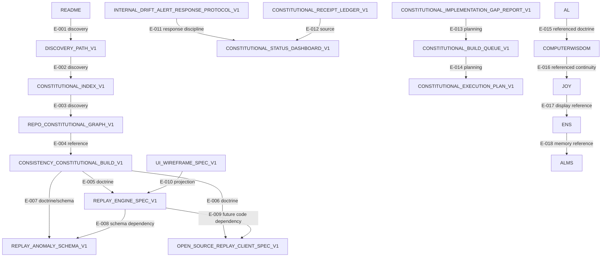

# CONSTITUTIONAL_DEPENDENCY_REGISTRY_V1

Authority: false  
Purpose: Single registry of every dependency edge between AL, COMPUTERWISDOM, JOY, ALMS, ENS, and Anti-Drift News artifacts in PR #202  
Invariant: Every dependency edge must be represented exactly once

---

## Registry Summary

| Metric | Count |
|---|---:|
| Total Dependency Edges | 18 |
| Intra-Repo Edges | 14 |
| Cross-Repo Referenced Edges | 4 |
| Verified Anchor Edges | 0 |
| Critical Path Edges | 7 |
| Receipt Types Required | 5 |

Status boundary:

```json
{
  "intra_repo_edges": "documented in COMPUTERWISDOM branch",
  "cross_repo_edges": "referenced but not independently anchored",
  "verified_anchor_edges": 0,
  "authority": false
}
```

---

## 1. Dependency Inventory

| edge_id | source_artifact | target_artifact | dependency_type | receipt_required | verification_method | promotion_gate | authority |
|---|---|---|---|---|---|---|---|
| E-001 | README_CONSTITUTIONAL_DISCOVERY_ENTRY | DISCOVERY_PATH_V1 | discovery_edge | DOC_RECEIPT | local file link check | G-DOC | false |
| E-002 | DISCOVERY_PATH_V1 | CONSTITUTIONAL_INDEX_V1 | discovery_edge | DOC_RECEIPT | local file link check | G-DOC | false |
| E-003 | CONSTITUTIONAL_INDEX_V1 | REPO_CONSTITUTIONAL_GRAPH_V1 | discovery_edge | DOC_RECEIPT | local file link check | G-DOC | false |
| E-004 | REPO_CONSTITUTIONAL_GRAPH_V1 | CONSISTENCY_CONSTITUTIONAL_BUILD_V1 | reference_edge | DOC_RECEIPT | local file link check | G-DOC | false |
| E-005 | CONSISTENCY_CONSTITUTIONAL_BUILD_V1 | REPLAY_ENGINE_SPEC_V1 | doctrine_edge | DOC_RECEIPT | manual doc review | G-DOC | false |
| E-006 | CONSISTENCY_CONSTITUTIONAL_BUILD_V1 | OPEN_SOURCE_REPLAY_CLIENT_SPEC_V1 | doctrine_edge | DOC_RECEIPT | manual doc review | G-DOC | false |
| E-007 | CONSISTENCY_CONSTITUTIONAL_BUILD_V1 | REPLAY_ANOMALY_SCHEMA_V1 | doctrine_edge | DOC_RECEIPT, SCHEMA_RECEIPT | schema existence check | G-SCHEMA | false |
| E-008 | REPLAY_ENGINE_SPEC_V1 | REPLAY_ANOMALY_SCHEMA_V1 | schema_dependency_edge | SCHEMA_RECEIPT | schema file check | G-SCHEMA | false |
| E-009 | REPLAY_ENGINE_SPEC_V1 | OPEN_SOURCE_REPLAY_CLIENT_SPEC_V1 | client_dependency_edge | CODE_RECEIPT | future import/build test | G-CODE | false |
| E-010 | UI_WIREFRAME_SPEC_V1 | REPLAY_ENGINE_SPEC_V1 | ui_projection_edge | DOC_RECEIPT | manual doc review | G-DOC | false |
| E-011 | INTERNAL_DRIFT_ALERT_RESPONSE_PROTOCOL_V1 | CONSTITUTIONAL_STATUS_DASHBOARD_V1 | response_discipline_edge | DOC_RECEIPT | manual doc review | G-DOC | false |
| E-012 | CONSTITUTIONAL_RECEIPT_LEDGER_V1 | CONSTITUTIONAL_STATUS_DASHBOARD_V1 | receipt_source_edge | DOC_RECEIPT | ledger/dashboard consistency review | G-DOC | false |
| E-013 | CONSTITUTIONAL_IMPLEMENTATION_GAP_REPORT_V1 | CONSTITUTIONAL_BUILD_QUEUE_V1 | planning_edge | DOC_RECEIPT | manual doc review | G-DOC | false |
| E-014 | CONSTITUTIONAL_BUILD_QUEUE_V1 | CONSTITUTIONAL_EXECUTION_PLAN_V1 | planning_edge | DOC_RECEIPT | manual doc review | G-DOC | false |
| E-015 | AL | COMPUTERWISDOM | cross_repo_doctrine_reference | ANCHOR_RECEIPT | future cross-repo receipt | G-ANCHOR | false |
| E-016 | COMPUTERWISDOM | JOY | cross_repo_continuity_reference | ANCHOR_RECEIPT | future cross-repo receipt | G-ANCHOR | false |
| E-017 | JOY | ENS | identity_display_reference | ANCHOR_RECEIPT | future ENS/content receipt | G-ANCHOR | false |
| E-018 | ENS | ALMS | memory_reference | ANCHOR_RECEIPT | future ALMS receipt | G-ANCHOR | false |

---

## 2. Critical Path Analysis

Critical docs path:

```txt
README
 -> DISCOVERY_PATH_V1
 -> CONSTITUTIONAL_INDEX_V1
 -> REPO_CONSTITUTIONAL_GRAPH_V1
 -> CONSISTENCY_CONSTITUTIONAL_BUILD_V1
 -> REPLAY_ENGINE_SPEC_V1
 -> OPEN_SOURCE_REPLAY_CLIENT_SPEC_V1
 -> REPLAY_ANOMALY_SCHEMA_V1
```

Blocking for documentation foundation:

| edge_id | edge | blocking | reason |
|---|---|---|---|
| E-001 | README -> DISCOVERY | yes | visitor entrypoint |
| E-002 | DISCOVERY -> INDEX | yes | onboarding route |
| E-003 | INDEX -> GRAPH | yes | topology route |
| E-004 | GRAPH -> CONSISTENCY | yes | doctrine route |
| E-005 | CONSISTENCY -> REPLAY_ENGINE_SPEC | yes | replay doctrine route |
| E-006 | CONSISTENCY -> CLIENT_SPEC | yes | public verification route |
| E-008 | REPLAY_ENGINE_SPEC -> ANOMALY_SCHEMA | yes | anomaly schema binding |

Blocking for runtime implementation: not satisfied yet. Runtime edges require future CODE_RECEIPT, TEST_RECEIPT, and CI_RECEIPT.

---

## 3. Circular Dependency Detection

Allowed documentation references:

```txt
CONSTITUTIONAL_INDEX_V1 may reference REPO_CONSTITUTIONAL_GRAPH_V1.
REPO_CONSTITUTIONAL_GRAPH_V1 may reference CONSTITUTIONAL_INDEX_V1.
```

Forbidden future runtime cycles:

- code module A requiring code module B while B requires A for compilation
- deployment A requiring deployment B while B requires deployment A
- authority cycle where artifact A verifies B and B verifies A without external receipt

Current blocking runtime cycles:

```json
{
  "blocking_runtime_cycles_detected": false,
  "authority": false
}
```

---

## 4. Promotion Gate Matrix

| gate_id | edge_ids | prerequisite_receipts | status |
|---|---|---|---|
| G-DOC | E-001 through E-006, E-010 through E-014 | DOC_RECEIPT | DOCUMENTED |
| G-SCHEMA | E-007, E-008 | SCHEMA_RECEIPT | PARTIAL: anomaly schema exists |
| G-CODE | E-009 | CODE_RECEIPT | PENDING |
| G-ANCHOR | E-015 through E-018 | ANCHOR_RECEIPT | PENDING |
| G-DEPLOY | future deployment edges | DEPLOYMENT_RECEIPT | PENDING |

No gate is promoted to VERIFIED without required receipts.

---

## 5. Receipt Requirements

| dependency_type | required_receipts | expiration |
|---|---|---|
| discovery_edge | DOC_RECEIPT | doc change |
| reference_edge | DOC_RECEIPT | doc change |
| doctrine_edge | DOC_RECEIPT | doc change |
| schema_dependency_edge | SCHEMA_RECEIPT | schema change |
| client_dependency_edge | CODE_RECEIPT, TEST_RECEIPT, CI_RECEIPT | code/test change |
| ui_projection_edge | DOC_RECEIPT, future CODE_RECEIPT | UI implementation change |
| response_discipline_edge | DOC_RECEIPT | protocol change |
| receipt_source_edge | DOC_RECEIPT | ledger/dashboard change |
| planning_edge | DOC_RECEIPT | plan change |
| cross_repo_doctrine_reference | ANCHOR_RECEIPT | target change |
| cross_repo_continuity_reference | ANCHOR_RECEIPT | target change |
| identity_display_reference | ANCHOR_RECEIPT | ENS/display change |
| memory_reference | ANCHOR_RECEIPT | ALMS target change |

---

## 6. Cross-Repo Verification Commands

Future AL edge verification:

```bash
git ls-remote https://github.com/jsonwisdom/AL.git
# Then verify target commit and referenced file hash before marking ANCHORED.
```

Future JOY edge verification:

```bash
git ls-remote https://github.com/jsonwisdom/JOY.git
# Then verify target commit and referenced file hash before marking ANCHORED.
```

Future ALMS edge verification:

```bash
git ls-remote https://github.com/jsonwisdom/layered-proofing-state-level-alms.git
# Then verify target commit and referenced file hash before marking ANCHORED.
```

Future ENS/display verification:

```bash
# Verify ENS/display record only after a concrete record name and resolver are defined.
```

---

## 7. Drift Detection Rules

### 7.1 Authority Drift

```bash
grep -R "authority.*true" docs schemas || true
```

Any unsafe authority true posture requires review.

### 7.2 Missing Target Drift

```bash
for path in \
  README.md \
  docs/discovery_path_v1.md \
  docs/constitutional_index_v1.md \
  docs/repo_constitutional_graph_v1.md \
  docs/anti_drift_news/consistency_constitutional_build_v1.md \
  docs/anti_drift_news/replay_engine_spec_v1.md \
  docs/anti_drift_news/open_source_replay_client_spec_v1.md \
  schemas/replay_anomaly.v1.schema.json; do
  test -f "$path" || echo "MISSING $path"
done
```

### 7.3 Promotion Gate Drift

```bash
grep -R "VERIFIED\|DEPLOYED\|ANCHORED" docs/constitutional_*_v1.md
```

Any claimed verified/deployed/anchored status must point to the corresponding receipt.

### 7.4 Fake Receipt Drift

```bash
grep -R "rec_[a-z0-9]\{6\}" docs || true
```

Placeholder receipts must not be treated as evidence.

---

## 8. Missing Dependency Audit

Expected unique edge IDs:

```txt
E-001 through E-018
```

Audit:

```bash
grep -o "E-[0-9][0-9][0-9]" docs/constitutional_dependency_registry_v1.md | sort | uniq -c
```

Every edge must appear intentionally and not be duplicated as a registry row.

---

## Appendix A: Dependency Graph



---

## Appendix B: Dependency Registry JSON

```json
{
  "version": "V1",
  "authority": false,
  "edge_count": 18,
  "verified_anchor_edges": 0,
  "edges": [
    {
      "edge_id": "E-001",
      "source_artifact": "README_CONSTITUTIONAL_DISCOVERY_ENTRY",
      "target_artifact": "DISCOVERY_PATH_V1",
      "dependency_type": "discovery_edge",
      "receipt_required": "DOC_RECEIPT",
      "verification_method": "local file link check",
      "promotion_gate": "G-DOC",
      "authority": false
    },
    {
      "edge_id": "E-018",
      "source_artifact": "ENS",
      "target_artifact": "ALMS",
      "dependency_type": "memory_reference",
      "receipt_required": "ANCHOR_RECEIPT",
      "verification_method": "future ALMS receipt",
      "promotion_gate": "G-ANCHOR",
      "authority": false
    }
  ],
  "note": "Full registry is the human-readable table above. Future machine export may be split into JSON."
}
```

---

## Canon

Dependencies are observable.  
Edges are verifiable.  
Promotion follows receipts.  
Authority is false.

This site does not ask you to trust it.  
It gives you the math to verify it.

Not anti-news.  
Anti-drift.  
Public receipts from day one.
