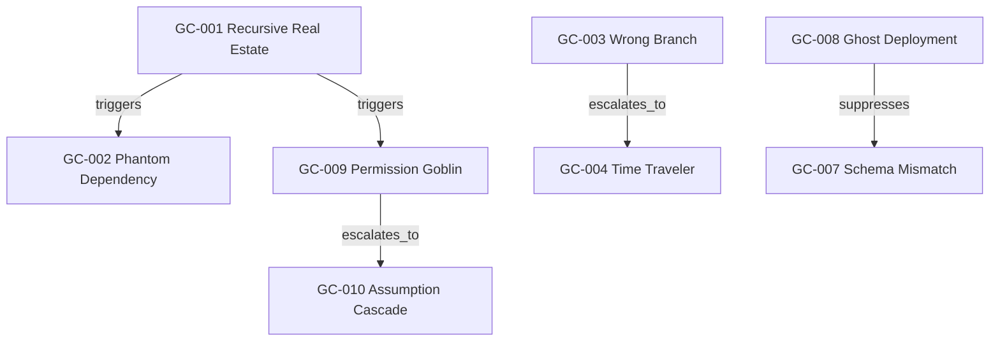
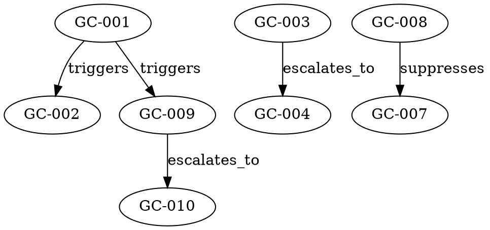

# Goblin Court V0.2 — Relationship Graph Design

## Status

```json
{
  "artifact": "GOBLIN_RELATIONSHIP_GRAPH_V0_2",
  "status": "IMPLEMENTATION_CANDIDATE",
  "implementation_surface": "STATIC_SPEC_ONLY",
  "runtime_verified": false,
  "anchored": false,
  "authority": false
}
```

## Foundation

Goblin Court V0.1 is sealed and Base mainnet anchored. V0.2 must not mutate V0.1, alter the V0.1 packet hash, reinterpret the V0.1 EAS attestation, or promote graph edges into truth, liability, or adjudication.

V0.2 is an optional relationship-graph overlay.

## Purpose

V0.1 identifies individual assumption failures. V0.2 models relationships among those failures so replay can examine possible assumption chains.

The graph assists reconstruction. The graph does not assert causation.

## Nodes

| Node | Name | One-line description |
|---|---|---|
| GC-001 | Recursive Real Estate | Wrong directory or repository context creates false assumptions about where commands are running. |
| GC-002 | Phantom Dependency | Missing or misread dependency state creates misleading execution failures. |
| GC-003 | Wrong Branch | Operator acts from an unintended branch or branch state. |
| GC-004 | Time Traveler | Operator acts from an unintended commit, tag, or historical state. |
| GC-005 | Wrong Network | Operator targets the wrong chain, RPC, network, or environment. |
| GC-006 | Invisible Environment | Required environment variables, secrets, or configuration are missing or unseen. |
| GC-007 | Schema Mismatch | Data shape, schema, ABI, or expected format diverges from consumer expectations. |
| GC-008 | Ghost Deployment | A deployment or state change appears successful but has not actually taken effect. |
| GC-009 | Permission Goblin | Missing rights, blocked writes, or protected branches prevent intended action. |
| GC-010 | Assumption Cascade | Meta-rule that witnesses clustered assumption failures without judging them. |

## Edge Types

```json
[
  "triggers",
  "depends_on",
  "escalates_to",
  "suppresses",
  "witnesses"
]
```

Definitions:

- `triggers`: one goblin commonly creates symptoms associated with another.
- `depends_on`: one goblin typically requires another context to be evaluated.
- `escalates_to`: unresolved state often produces another goblin.
- `suppresses`: one goblin can mask another during replay.
- `witnesses`: goblins appear together without causal claim.

Forbidden edge meanings:

```json
[
  "proves",
  "convicts",
  "caused_with_authority",
  "liable_for",
  "must_block"
]
```

## Example Relationships

```json
[
  {"from": "GC-001", "edge": "triggers", "to": "GC-002"},
  {"from": "GC-001", "edge": "triggers", "to": "GC-009"},
  {"from": "GC-006", "edge": "depends_on", "to": "GC-001"},
  {"from": "GC-003", "edge": "escalates_to", "to": "GC-004"},
  {"from": "GC-005", "edge": "triggers", "to": "GC-002"},
  {"from": "GC-008", "edge": "suppresses", "to": "GC-007"},
  {"from": "GC-009", "edge": "escalates_to", "to": "GC-010"},
  {"from": "GC-010", "edge": "witnesses", "to": "GC-001"},
  {"from": "GC-010", "edge": "witnesses", "to": "GC-002"},
  {"from": "GC-010", "edge": "witnesses", "to": "GC-005"},
  {"from": "GC-010", "edge": "witnesses", "to": "GC-009"}
]
```

## GC-010 Special Role

```json
{
  "GC-010": {
    "role": "cascade_witness",
    "declares_truth": false,
    "assigns_blame": false,
    "blocks_execution": false,
    "authority": false
  }
}
```

GC-010 may observe repeated goblin appearance, clustered goblin appearance, and assumption-chain growth. GC-010 does not determine truth, assign blame, enforce outcomes, or block execution.

## Graph Traversal for Replay

Traversal produces replay candidates only.

Example:

```json
{
  "observed": ["GC-009"],
  "possible_replay_paths": [
    ["GC-001", "GC-002", "GC-009"],
    ["GC-006", "GC-009"]
  ],
  "candidate_only": true,
  "causal_proof_claim": false,
  "authority": false
}
```

A replay path is a navigation aid. It is not a verdict.

## Visualization Options

### Mermaid



### DOT



### Adjacency List

```json
{
  "GC-001": {
    "triggers": ["GC-002", "GC-009"]
  },
  "GC-003": {
    "escalates_to": ["GC-004"]
  },
  "GC-008": {
    "suppresses": ["GC-007"]
  },
  "GC-010": {
    "witnesses": ["GC-001", "GC-002", "GC-005", "GC-009"]
  }
}
```

## Optional Overlay Doctrine

```json
{
  "graph_required_for_v0_1_replay": false,
  "graph_overlay_optional": true,
  "visualization_is_authoritative": false,
  "authority": false
}
```

V0.2 may improve navigation and replay analysis, but V0.1 remains replayable without V0.2.

## Invariants

```json
{
  "AUTHORITY_FALSE": true,
  "NO_SILENT_CATEGORY_PROMOTION": true,
  "REPLAY_NATIVE": true,
  "OBSERVER_ONLY_DOCTRINE": true
}
```

## Non-Goals

```json
[
  "runtime enforcement",
  "automated blocking",
  "adjudication",
  "truth determination",
  "liability assignment",
  "rewriting V0.1",
  "changing sealed V0.1 packet hash",
  "changing sealed V0.1 EAS attestation"
]
```

## Future Exploration Areas

Future versions may explore traversal helpers, machine-readable graph schemas, replay fixtures, UI navigation, and cross-system ALMS integration. These are not claimed by V0.2 static spec.

## Closure

Goblin Court V0.2 relationship graph is an optional, non-authoritative overlay on sealed V0.1.

Authority remains false.
