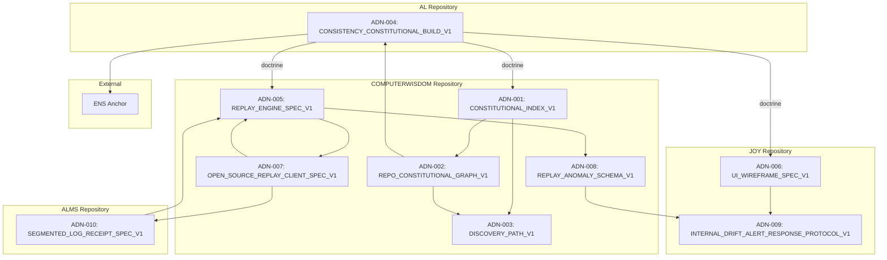

# REPO_CONSTITUTIONAL_GRAPH_V1

**Authority:** false  
**Purpose:** Visual and machine-readable dependency map of all constitutional artifacts across AL, COMPUTERWISDOM, JOY, ALMS, and ENS.

---

## NODES

### Repository Nodes

| Node ID | Repository | Surface |
|---------|------------|---------|
| AL | Authority-Less Law | Doctrine & Constitution |
| COMPUTERWISDOM | Replay Surfaces | Replay Engine & Client |
| JOY | Protection Surfaces | UI & Alert Protocol |
| ALMS | Memory Surfaces | Segmented Log Storage |
| ENS | Ethereum Name Service | Blockchain Anchor |

### Constitutional Artifacts

| Artifact ID | Name | Repository |
|-------------|------|------------|
| ADN-001 | CONSTITUTIONAL_INDEX_V1 | COMPUTERWISDOM |
| ADN-002 | REPO_CONSTITUTIONAL_GRAPH_V1 | COMPUTERWISDOM |
| ADN-003 | DISCOVERY_PATH_V1 | COMPUTERWISDOM |
| ADN-004 | CONSISTENCY_CONSTITUTIONAL_BUILD_V1 | AL |
| ADN-005 | REPLAY_ENGINE_SPEC_V1 | COMPUTERWISDOM |
| ADN-006 | UI_WIREFRAME_SPEC_V1 | JOY |
| ADN-007 | OPEN_SOURCE_REPLAY_CLIENT_SPEC_V1 | COMPUTERWISDOM |
| ADN-008 | REPLAY_ANOMALY_SCHEMA_V1 | COMPUTERWISDOM |
| ADN-009 | INTERNAL_DRIFT_ALERT_RESPONSE_PROTOCOL_V1 | JOY |
| ADN-010 | SEGMENTED_LOG_RECEIPT_SPEC_V1 | ALMS |

---

## EDGES

### Doctrine Edges (AL -> All)

| Edge ID | Source | Target | Type |
|---------|--------|--------|------|
| E-001 | AL | ADN-001 | doctrine |
| E-002 | AL | ADN-005 | doctrine |
| E-003 | AL | ADN-006 | doctrine |

### Reference Edges (COMPUTERWISDOM Internal)

| Edge ID | Source | Target | Type |
|---------|--------|--------|------|
| E-004 | ADN-001 | ADN-002 | references |
| E-005 | ADN-001 | ADN-003 | references |
| E-006 | ADN-002 | ADN-003 | references |
| E-007 | ADN-002 | ADN-004 | references |

### Implementation Edges

| Edge ID | Source | Target | Type |
|---------|--------|--------|------|
| E-008 | ADN-005 | ADN-008 | implements |
| E-009 | ADN-005 | ADN-007 | exports |
| E-010 | ADN-007 | ADN-010 | consumes |
| E-011 | ADN-007 | ADN-005 | embeds |
| E-012 | ADN-008 | ADN-009 | typed_by |

### Trigger Edges

| Edge ID | Source | Target | Type |
|---------|--------|--------|------|
| E-013 | ADN-006 | ADN-009 | triggers |

### Memory Edges

| Edge ID | Source | Target | Type |
|---------|--------|--------|------|
| E-014 | ADN-010 | ADN-005 | memory |

### Anchor Edges

| Edge ID | Source | Target | Type |
|---------|--------|--------|------|
| E-015 | AL | ENS | anchor |

---

## GRAPH VISUALIZATION (Mermaid)



---

## MACHINE-READABLE JSON

```json
{
  "version": "V1",
  "authority": false,
  "repositories": ["AL", "COMPUTERWISDOM", "JOY", "ALMS", "ENS"],
  "artifacts": [
    {"id": "ADN-001", "name": "CONSTITUTIONAL_INDEX_V1", "repo": "COMPUTERWISDOM"},
    {"id": "ADN-002", "name": "REPO_CONSTITUTIONAL_GRAPH_V1", "repo": "COMPUTERWISDOM"},
    {"id": "ADN-003", "name": "DISCOVERY_PATH_V1", "repo": "COMPUTERWISDOM"},
    {"id": "ADN-004", "name": "CONSISTENCY_CONSTITUTIONAL_BUILD_V1", "repo": "AL"},
    {"id": "ADN-005", "name": "REPLAY_ENGINE_SPEC_V1", "repo": "COMPUTERWISDOM"},
    {"id": "ADN-006", "name": "UI_WIREFRAME_SPEC_V1", "repo": "JOY"},
    {"id": "ADN-007", "name": "OPEN_SOURCE_REPLAY_CLIENT_SPEC_V1", "repo": "COMPUTERWISDOM"},
    {"id": "ADN-008", "name": "REPLAY_ANOMALY_SCHEMA_V1", "repo": "COMPUTERWISDOM"},
    {"id": "ADN-009", "name": "INTERNAL_DRIFT_ALERT_RESPONSE_PROTOCOL_V1", "repo": "JOY"},
    {"id": "ADN-010", "name": "SEGMENTED_LOG_RECEIPT_SPEC_V1", "repo": "ALMS"}
  ],
  "edges": [
    {"id": "E-001", "source": "AL", "target": "ADN-001", "type": "doctrine"},
    {"id": "E-002", "source": "AL", "target": "ADN-005", "type": "doctrine"},
    {"id": "E-003", "source": "AL", "target": "ADN-006", "type": "doctrine"},
    {"id": "E-004", "source": "ADN-001", "target": "ADN-002", "type": "references"},
    {"id": "E-005", "source": "ADN-001", "target": "ADN-003", "type": "references"},
    {"id": "E-006", "source": "ADN-002", "target": "ADN-003", "type": "references"},
    {"id": "E-007", "source": "ADN-002", "target": "ADN-004", "type": "references"},
    {"id": "E-008", "source": "ADN-005", "target": "ADN-008", "type": "implements"},
    {"id": "E-009", "source": "ADN-005", "target": "ADN-007", "type": "exports"},
    {"id": "E-010", "source": "ADN-007", "target": "ADN-010", "type": "consumes"},
    {"id": "E-011", "source": "ADN-007", "target": "ADN-005", "type": "embeds"},
    {"id": "E-012", "source": "ADN-008", "target": "ADN-009", "type": "typed_by"},
    {"id": "E-013", "source": "ADN-006", "target": "ADN-009", "type": "triggers"},
    {"id": "E-014", "source": "ADN-010", "target": "ADN-005", "type": "memory"},
    {"id": "E-015", "source": "AL", "target": "ENS", "type": "anchor"}
  ]
}
```

---

## CANON

Dependencies are observable. Edges are verifiable.

Not anti-news. Anti-drift. Public receipts from day one.
