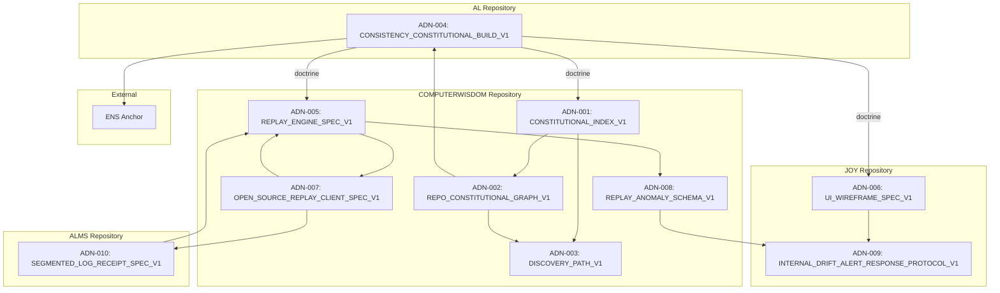
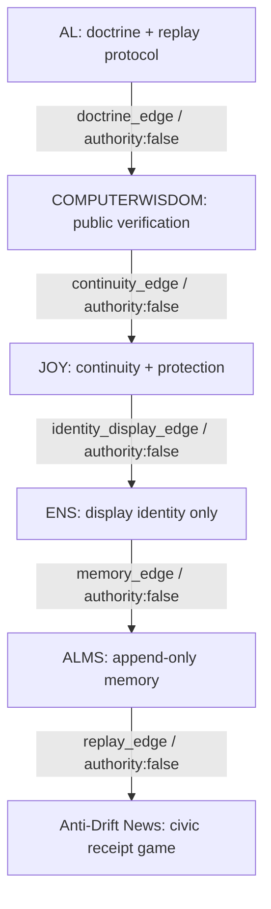

# REPO_CONSTITUTIONAL_GRAPH_V1

<<<<<<< HEAD
**Authority:** false  
**Purpose:** Visual and machine-readable dependency map of all constitutional artifacts across AL, COMPUTERWISDOM, JOY, ALMS, and ENS.

---

## NODES

### Repository Nodes

| Node ID | Repository | Surface |
|---------|------------|---------|
| AL | Authority-Less Law | Doctrine & Constitution |
| COMPUTERWISDOM | Replay Surfaces | Replay Engine & Client |
| JOY | Protection Surfaces | UI & Alert Protocol |
| ALMS | Memory Surfaces | Segmented Log Storage |
| ENS | Ethereum Name Service | Blockchain Anchor |

### Constitutional Artifacts

| Artifact ID | Name | Repository |
|-------------|------|------------|
| ADN-001 | CONSTITUTIONAL_INDEX_V1 | COMPUTERWISDOM |
| ADN-002 | REPO_CONSTITUTIONAL_GRAPH_V1 | COMPUTERWISDOM |
| ADN-003 | DISCOVERY_PATH_V1 | COMPUTERWISDOM |
| ADN-004 | CONSISTENCY_CONSTITUTIONAL_BUILD_V1 | AL |
| ADN-005 | REPLAY_ENGINE_SPEC_V1 | COMPUTERWISDOM |
| ADN-006 | UI_WIREFRAME_SPEC_V1 | JOY |
| ADN-007 | OPEN_SOURCE_REPLAY_CLIENT_SPEC_V1 | COMPUTERWISDOM |
| ADN-008 | REPLAY_ANOMALY_SCHEMA_V1 | COMPUTERWISDOM |
| ADN-009 | INTERNAL_DRIFT_ALERT_RESPONSE_PROTOCOL_V1 | JOY |
| ADN-010 | SEGMENTED_LOG_RECEIPT_SPEC_V1 | ALMS |

---

## EDGES

### Doctrine Edges (AL -> All)

| Edge ID | Source | Target | Type |
|---------|--------|--------|------|
| E-001 | AL | ADN-001 | doctrine |
| E-002 | AL | ADN-005 | doctrine |
| E-003 | AL | ADN-006 | doctrine |

### Reference Edges (COMPUTERWISDOM Internal)

| Edge ID | Source | Target | Type |
|---------|--------|--------|------|
| E-004 | ADN-001 | ADN-002 | references |
| E-005 | ADN-001 | ADN-003 | references |
| E-006 | ADN-002 | ADN-003 | references |
| E-007 | ADN-002 | ADN-004 | references |

### Implementation Edges

| Edge ID | Source | Target | Type |
|---------|--------|--------|------|
| E-008 | ADN-005 | ADN-008 | implements |
| E-009 | ADN-005 | ADN-007 | exports |
| E-010 | ADN-007 | ADN-010 | consumes |
| E-011 | ADN-007 | ADN-005 | embeds |
| E-012 | ADN-008 | ADN-009 | typed_by |

### Trigger Edges

| Edge ID | Source | Target | Type |
|---------|--------|--------|------|
| E-013 | ADN-006 | ADN-009 | triggers |

### Memory Edges

| Edge ID | Source | Target | Type |
|---------|--------|--------|------|
| E-014 | ADN-010 | ADN-005 | memory |

### Anchor Edges

| Edge ID | Source | Target | Type |
|---------|--------|--------|------|
| E-015 | AL | ENS | anchor |

---

## GRAPH VISUALIZATION (Mermaid)



---

## MACHINE-READABLE JSON

```json
{
  "version": "V1",
  "authority": false,
  "repositories": ["AL", "COMPUTERWISDOM", "JOY", "ALMS", "ENS"],
  "artifacts": [
    {"id": "ADN-001", "name": "CONSTITUTIONAL_INDEX_V1", "repo": "COMPUTERWISDOM"},
    {"id": "ADN-002", "name": "REPO_CONSTITUTIONAL_GRAPH_V1", "repo": "COMPUTERWISDOM"},
    {"id": "ADN-003", "name": "DISCOVERY_PATH_V1", "repo": "COMPUTERWISDOM"},
    {"id": "ADN-004", "name": "CONSISTENCY_CONSTITUTIONAL_BUILD_V1", "repo": "AL"},
    {"id": "ADN-005", "name": "REPLAY_ENGINE_SPEC_V1", "repo": "COMPUTERWISDOM"},
    {"id": "ADN-006", "name": "UI_WIREFRAME_SPEC_V1", "repo": "JOY"},
    {"id": "ADN-007", "name": "OPEN_SOURCE_REPLAY_CLIENT_SPEC_V1", "repo": "COMPUTERWISDOM"},
    {"id": "ADN-008", "name": "REPLAY_ANOMALY_SCHEMA_V1", "repo": "COMPUTERWISDOM"},
    {"id": "ADN-009", "name": "INTERNAL_DRIFT_ALERT_RESPONSE_PROTOCOL_V1", "repo": "JOY"},
    {"id": "ADN-010", "name": "SEGMENTED_LOG_RECEIPT_SPEC_V1", "repo": "ALMS"}
  ],
  "edges": [
    {"id": "E-001", "source": "AL", "target": "ADN-001", "type": "doctrine"},
    {"id": "E-002", "source": "AL", "target": "ADN-005", "type": "doctrine"},
    {"id": "E-003", "source": "AL", "target": "ADN-006", "type": "doctrine"},
    {"id": "E-004", "source": "ADN-001", "target": "ADN-002", "type": "references"},
    {"id": "E-005", "source": "ADN-001", "target": "ADN-003", "type": "references"},
    {"id": "E-006", "source": "ADN-002", "target": "ADN-003", "type": "references"},
    {"id": "E-007", "source": "ADN-002", "target": "ADN-004", "type": "references"},
    {"id": "E-008", "source": "ADN-005", "target": "ADN-008", "type": "implements"},
    {"id": "E-009", "source": "ADN-005", "target": "ADN-007", "type": "exports"},
    {"id": "E-010", "source": "ADN-007", "target": "ADN-010", "type": "consumes"},
    {"id": "E-011", "source": "ADN-007", "target": "ADN-005", "type": "embeds"},
    {"id": "E-012", "source": "ADN-008", "target": "ADN-009", "type": "typed_by"},
    {"id": "E-013", "source": "ADN-006", "target": "ADN-009", "type": "triggers"},
    {"id": "E-014", "source": "ADN-010", "target": "ADN-005", "type": "memory"},
    {"id": "E-015", "source": "AL", "target": "ENS", "type": "anchor"}
=======
Repository constitutional topology for Jay Wisdom replay systems.  
Authority: false  
Status: Active topology artifact

---

## Purpose

Create a visual and machine-readable dependency map of all constitutional artifacts across AL, COMPUTERWISDOM, JOY, ENS, ALMS, and Anti-Drift News.

The graph prevents:

- orphaned specs
- silent authority mutation
- undocumented promotion
- hidden dependency drift
- untraceable constitutional lineage

---

## 1. Repository Nodes

```json
{
  "nodes": [
    {
      "id": "AL",
      "repo": "jsonwisdom/AL",
      "role": "doctrine_and_replay_protocol",
      "authority": false
    },
    {
      "id": "COMPUTERWISDOM",
      "repo": "jsonwisdom/COMPUTERWISDOM",
      "role": "public_verification_surface",
      "authority": false
    },
    {
      "id": "JOY",
      "repo": "jsonwisdom/JOY",
      "role": "continuity_and_protection_membrane",
      "authority": false
    },
    {
      "id": "ENS",
      "repo": null,
      "role": "display_identity_only",
      "authority": false
    },
    {
      "id": "ALMS",
      "repo": "jsonwisdom/layered-proofing-state-level-alms",
      "role": "append_only_memory_and_receipts",
      "authority": false
    },
    {
      "id": "ANTI_DRIFT_NEWS",
      "repo": "jsonwisdom/COMPUTERWISDOM",
      "role": "civic_receipt_game_application",
      "authority": false
    }
>>>>>>> 06c86f9 (Add repo constitutional graph v1)
  ]
}
```

---

<<<<<<< HEAD
## CANON

Dependencies are observable. Edges are verifiable.

Not anti-news. Anti-drift. Public receipts from day one.
=======
## 2. Constitutional Artifacts

```json
{
  "artifacts": [
    {
      "id": "CONSTITUTIONAL_INDEX_V1",
      "path": "docs/constitutional_index_v1.md",
      "repo": "jsonwisdom/COMPUTERWISDOM",
      "role": "discovery_index",
      "authority": false
    },
    {
      "id": "CONSISTENCY_CONSTITUTIONAL_BUILD_V1",
      "path": "docs/anti_drift_news/consistency_constitutional_build_v1.md",
      "repo": "jsonwisdom/COMPUTERWISDOM",
      "role": "anti_drift_constitution",
      "authority": false
    },
    {
      "id": "REPLAY_ENGINE_SPEC_V1",
      "path": "docs/anti_drift_news/replay_engine_spec_v1.md",
      "repo": "jsonwisdom/COMPUTERWISDOM",
      "role": "deterministic_replay_engine_spec",
      "authority": false
    },
    {
      "id": "UI_WIREFRAME_SPEC_V1",
      "path": "docs/anti_drift_news/ui_wireframe_spec_v1.md",
      "repo": "jsonwisdom/COMPUTERWISDOM",
      "role": "public_evidence_ui_contract",
      "authority": false
    },
    {
      "id": "OPEN_SOURCE_REPLAY_CLIENT_SPEC_V1",
      "path": "docs/anti_drift_news/open_source_replay_client_spec_v1.md",
      "repo": "jsonwisdom/COMPUTERWISDOM",
      "role": "public_replay_client_spec",
      "authority": false
    },
    {
      "id": "REPLAY_ANOMALY_SCHEMA_V1",
      "path": "schemas/replay_anomaly.v1.schema.json",
      "repo": "jsonwisdom/COMPUTERWISDOM",
      "role": "machine_readable_anomaly_schema",
      "authority": false
    },
    {
      "id": "INTERNAL_DRIFT_ALERT_RESPONSE_PROTOCOL_V1",
      "path": "docs/anti_drift_news/internal_drift_alert_response_protocol_v1.md",
      "repo": "jsonwisdom/COMPUTERWISDOM",
      "role": "response_discipline_protocol",
      "authority": false
    }
  ]
}
```

---

## 3. Dependency Edges

```json
{
  "edges": [
    {
      "from": "AL",
      "to": "COMPUTERWISDOM",
      "type": "doctrine_edge",
      "rule": "AL supplies doctrine; COMPUTERWISDOM publishes verification surfaces.",
      "authority": false
    },
    {
      "from": "COMPUTERWISDOM",
      "to": "JOY",
      "type": "continuity_edge",
      "rule": "JOY protects voice, custody, continuity, and safety membrane.",
      "authority": false
    },
    {
      "from": "JOY",
      "to": "ENS",
      "type": "identity_display_edge",
      "rule": "ENS displays identity only; ENS is not authority.",
      "authority": false
    },
    {
      "from": "ENS",
      "to": "ALMS",
      "type": "memory_edge",
      "rule": "ALMS remembers routes and receipts.",
      "authority": false
    },
    {
      "from": "ALMS",
      "to": "ANTI_DRIFT_NEWS",
      "type": "replay_edge",
      "rule": "Anti-Drift consumes append-only memory as replay substrate.",
      "authority": false
    }
  ]
}
```

---

## 4. Promotion Rules

```json
{
  "promotion_rules": {
    "memory_allowed": true,
    "promotion_blocked_until_receipt": true,
    "authority": false,
    "identity_display_is_authority": false,
    "snapshot_is_authority": false,
    "server_is_authority": false,
    "client_is_verification": true
  }
}
```

---

## 5. Replay Rules

```json
{
  "replay_rules": {
    "invalid_events_never_change_state": true,
    "valid_events_always_produce_deterministic_state": true,
    "duplicate_event_id_is_never_update": true,
    "unknown_remains_unknown_until_supported": true,
    "replay_supremacy": true,
    "authority": false
  }
}
```

---

## 6. Markdown Graph

```txt
AL
 └─ doctrine_edge
    ↓
COMPUTERWISDOM
 └─ public verification surface
    ↓
JOY
 └─ continuity and protection membrane
    ↓
ENS
 └─ display identity only
    ↓
ALMS
 └─ append-only memory and receipts
    ↓
ANTI_DRIFT_NEWS
 └─ civic receipt game application
```

---

## 7. Mermaid Graph



---

## 8. Canon Phrase

This site does not ask you to trust it.  
It gives you the math to verify it.

Not anti-news.  
Anti-drift.  
Public receipts from day one.

---

## Final Rule

An auditor should be able to traverse the entire constitutional system as a graph.
>>>>>>> 06c86f9 (Add repo constitutional graph v1)
